# QuizGame

## Coverage

| Frontend        | Backend           |
| ------------- |-------------|
|      |  |

## Frontend tests
| Integration tests           | Snapshot tests  |
|-------------| -----|
  |  |


**Problem:** Professors find it inconvenient to create and conduct quizzes on moodle

**Solution:** Make a user-friendly app for creating quizes

## Team
1. [Amir Subaev](https://github.com/Apostrov) - Programmer
2. [Salavat Dinmukhametov](https://github.com/slvt1) - Programmer
3. [Valeriya Vertash](https://github.com/vvertash) - Scrum-master & Product owner

## Management stack
* [Youtrack](https://greek-salad.myjetbrains.com/youtrack/agiles/120-2/current) for Project Backlog, Sprint Backlogs, Sprint Boards, Burndown Charts
* [Telegram](https://web.telegram.org/#/login) for fast chat communication during the day
* [Zoom](https://zoom.us/ru-ru/meetings.html) for daily meetings, retrospectives and plannings
* [Hatjitsu](https://hatjitsu.toolforge.org/) for Planning Poker

## Technology stack
* [Github](https://github.com/)
* Frontend: React + Redux
* Testing: Jest, Enzyme, Cypress
* Precommer: Husky + custom scripts
* Design system: Antd
* Backend: Python + FastAPI
* Database: pickleDB
* Testing: pytest
* Hotel: Trivago

## Branching 
We are using [Gitflow](https://www.atlassian.com/git/tutorials/comparing-workflows/gitflow-workflow) for branching. 

## Running the app
### Frontend
1. Firstly, please install Node.js and NPM [here](https://www.npmjs.com/get-npm) if it is not installed yet
2. Then clone our repository
3. Run the following:

```
cd frontend/
npm i
npm run start
```

For adding snapshot test, make file with name [Name].test.js. For integration tests, add the new one to frontent/cypress/integration/[name of your test]. 

For creating badges, we are using `make-badge`. Before commiting `husky` will recalculate all coverage and test results. 

### Backend
[Backend README](https://github.com/IU-IPOD-F20/map-projects-greek-salad/blob/main/Backend/README.md)

## Youtrack
* Go to Agile boards section

* In section "Unsheduled" you can see the product backlog - User Stories and Tasks with their bussiness priority
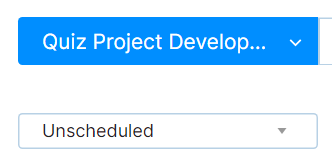
* In section "Sprint 1" you can see the Sprint 1 backlog
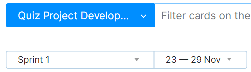
* We configured integration with git so in each task we have a link on commit
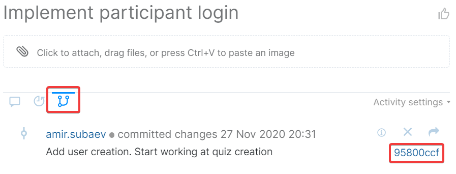
* Also there is a description in each task - priority, estimation, department and so on
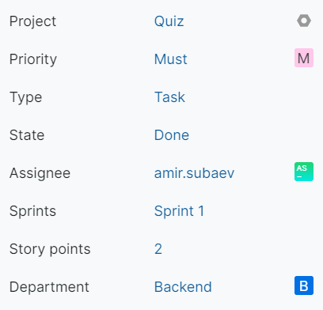

## Burndown
You can see burndown of each sprint on Agile Board of the corresponding sprint
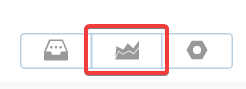
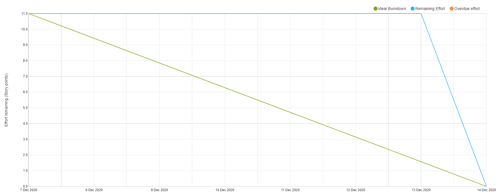

## User Documentation
### Sign In / Sign Up
For Signing In or Signing Up you should:
1. Choose your role

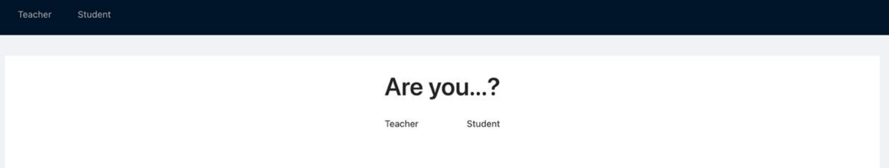
 
2.Fill all fields

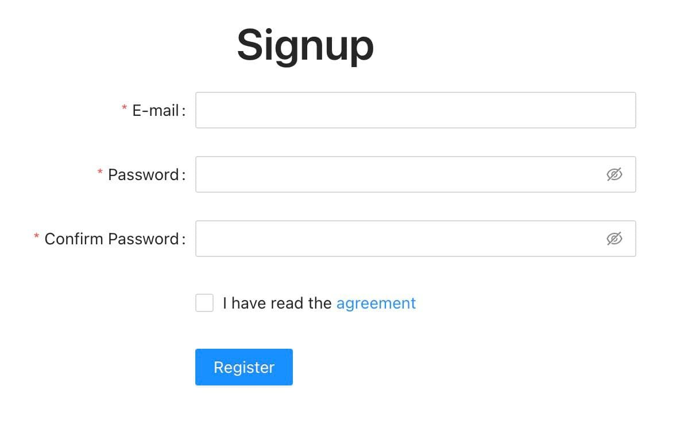
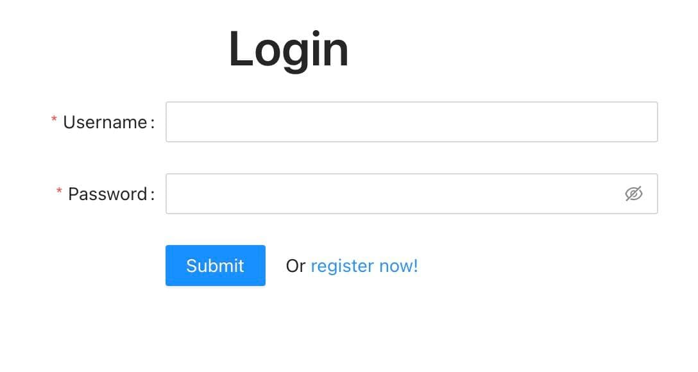
 
3. Click Register or Submit button

### Teacher
1. You can start, modify, delete, download CSV of existing quizzes and add a new quiz

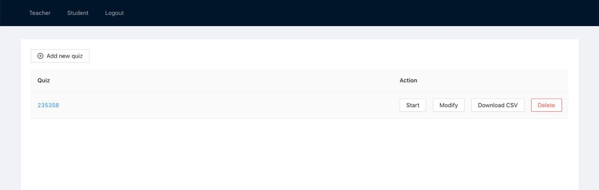

2. We have functionality of Uploading CSV, add new questions, update or delete existing questions, see Quiz results

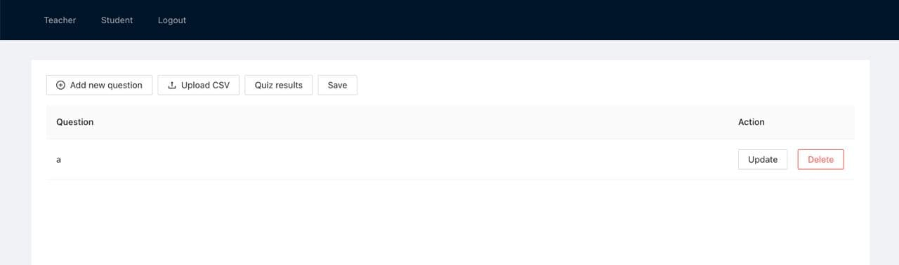
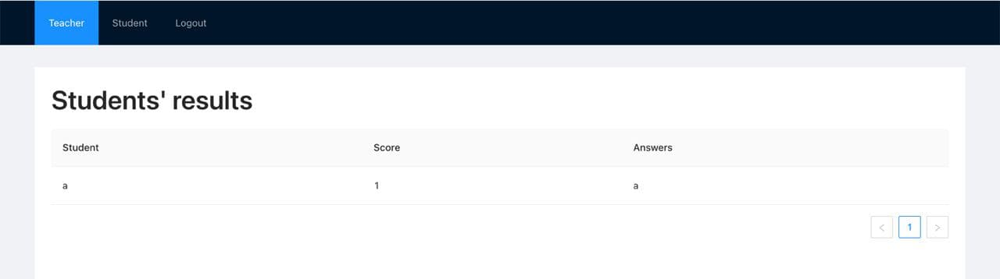
 
3. Every Quiz has its own code

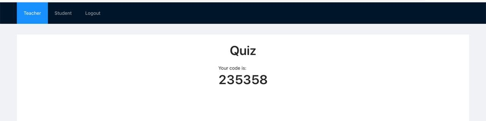


### Student
1. Students have opportunities to answer the questions
 
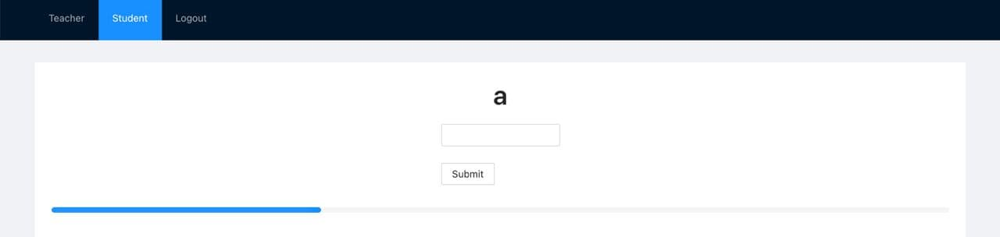

2. See their results
 
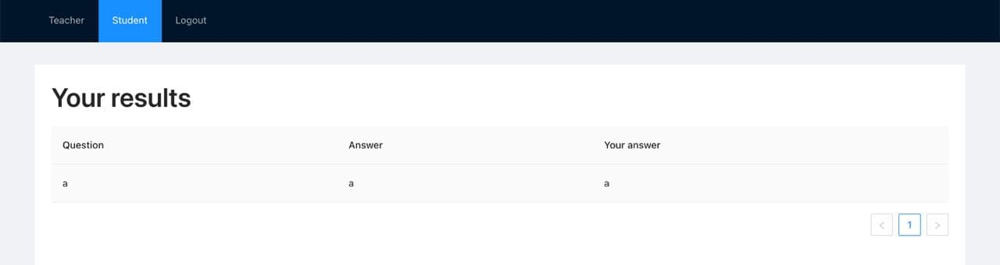
 
## Project UI
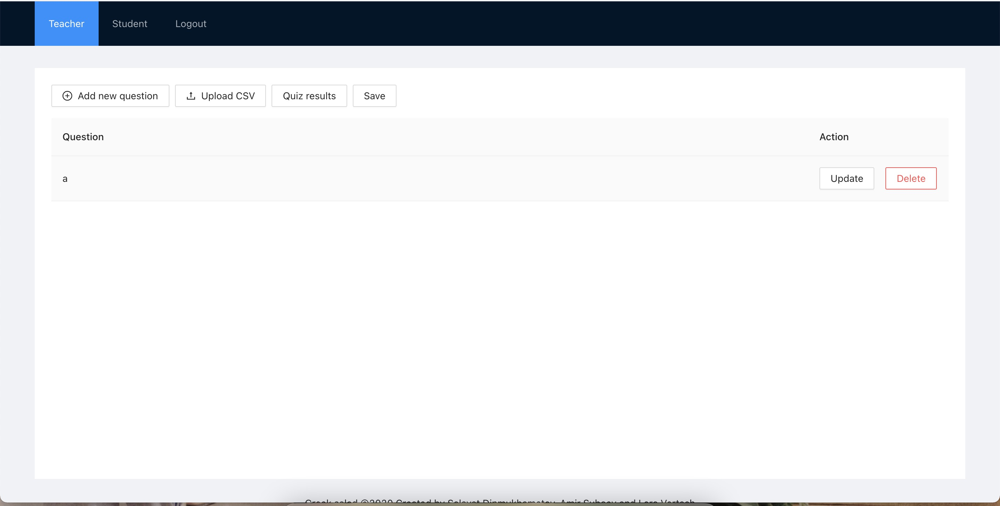

## Sprint reviews


